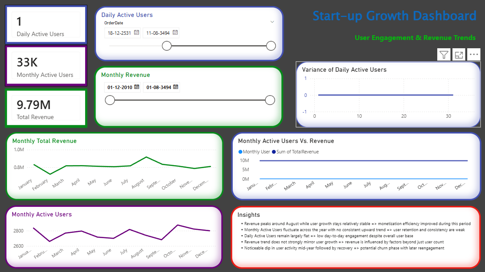

# Overview

This project analyzes user engagement and revenue trends using Power BI.

# Metrics Covered
Daily Active Users (DAU)
Monthly Active Users (MAU)
Revenue trends
# Key Insights
Revenue peaks despite stable user growth → improved monetization
MAU shows inconsistent trend → retention concerns
DAU remains flat → low daily engagement
# Tools Used
Excel (data cleaning)
SQL (identifying treands)
Power BI
## Dashboard Preview

